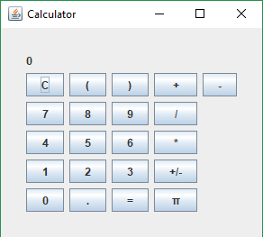

# BestCalculatorEver project

## Bevezető

Ez a számológép egy csapat egyetemista project munkájának eredménye.

A számológép moduláris tehát utólag hozzáadhatók műveletek és konstansok is, amik a következő indításkor automatikusan részét fogják képezni a beviteli felületnek.

Néhány alapművelet rendelkezésre áll.

A forráskódhoz teljes dokumentáció áll rendelkezésre, többek között UML osztály diagram is.



## Használat feltételei

Mivel az alkalmazás Java programozási nyelven íródott, ezért feltétlenül szükséges, hogy a Java Runtime Environment(JRE) 8-as verziója vagy annál frissebb változat telepítve legyen a számítógépre.

[JRE8](https://www.oracle.com/technetwork/java/javase/downloads/jre8-downloads-2133155.html)

## Használat

A számológép nem formulákat értékel ki, és precedencia sorrend sincs. A megadott műveleteket a megadott számokkal a bevitel sorrendjében számolja ki. Azonban van lehetőség zárójelezésre, amivel komplexebb műveletek is elvégezhetőek.

Ha további műveleteket vagy konstansok hozzáadására van szüksége felhasználónak, akkor a lefordított .class fájlt a bin mappába kell elhelyezni a helyes működés érdekében.

## Új műveletek készítése

A számológép 3 osztályt használ a műveletekhez és konstansokhoz:
1. 0 operandusú művelet, azaz konstans jelek, ami az `Operation_0` osztály.
2. 1 operandusú művelet, ami az `Operation_1` osztály.
3. 2 operandusú művelet, ami az `Operation_2` osztály.

Ezen absztrakt osztályok bővítésével lehet további műveleteket hozzáadni a számológéphez. Értelem szerűen ha mondjuk egy két operandusú műveletet szeretnénk hozzáadni, akkor az osztályunknak az `Operation_2` osztályt kell bővítenie.
Minden műveleti osztálynak kötelezően meg kell valósítania a következő metódusokat:
1. `calc()`: Ez a metódus fogja visszaadni a művelet eredményét. Konstansoknak ez adja vissza a konstans értékét.
2. `getSymbol()`: Ez a metódus adja vissza a számológép gombjain a műveletet reprezentáló jelet.

Az alábbi kód mintaként szolgálhat:
```
public class <név> extends <Operation_0/Operation_1/Operation_2> {
    public Double calc() {
		<művelet értékéhez szükséges számolások>
        return <művelet értéke>;
    }
    public String getSymbol() {
        return "<műveletet reprezentáló jel>";
    }
}
```

## Készítők
- Horváth János
- Mohos Bálint